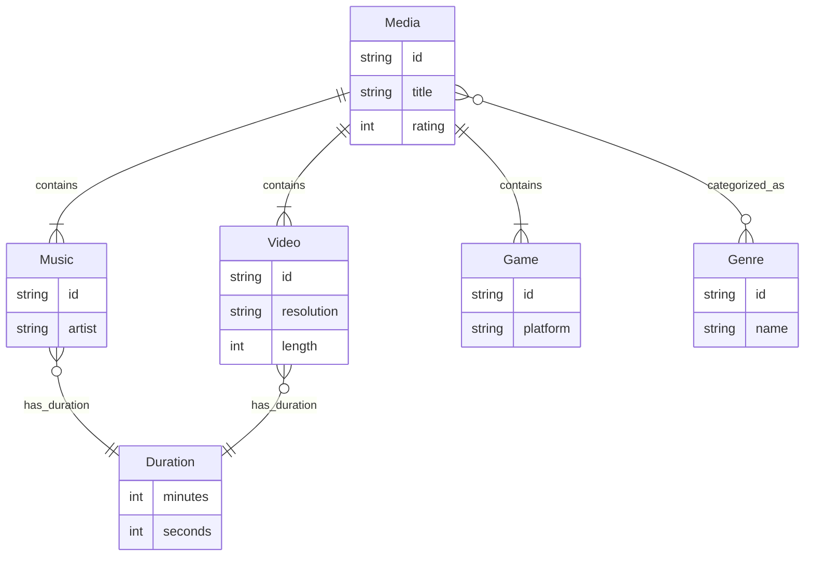

# UML

Eine kleine persönliche Medien Kollektion. Damit kann ich meine persönliche Medien Katalogisieren und bewerten. Es schafft mir auch einen Überblick mit allen nötigen Informationen. Ich könnte z.B nach dem Rating ordnen und so einen Überblick über meine beliebtesten Medien schaffen.