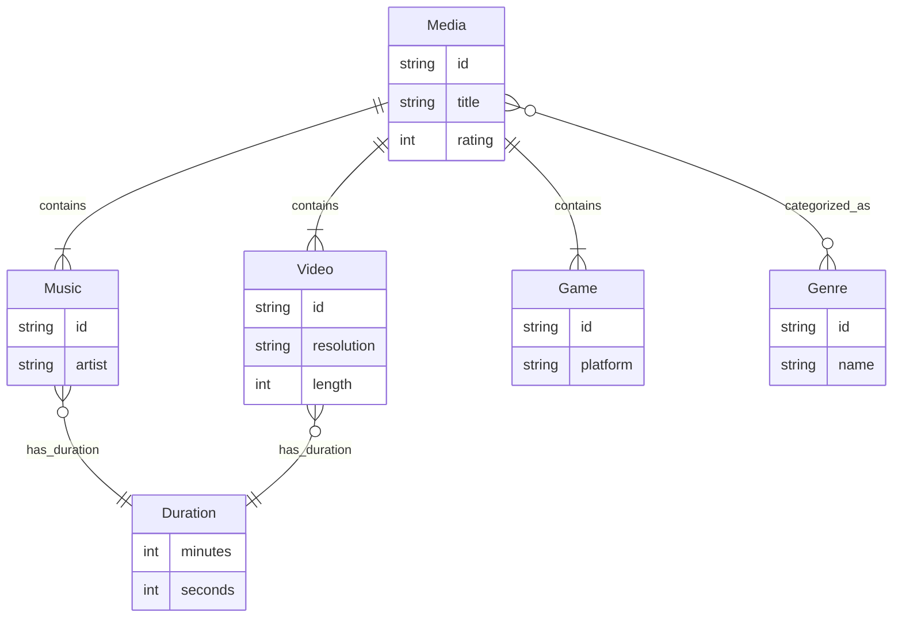
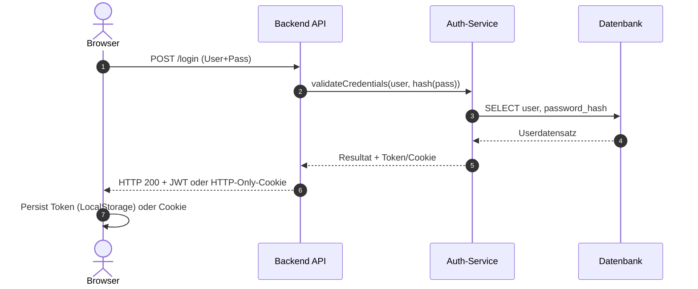
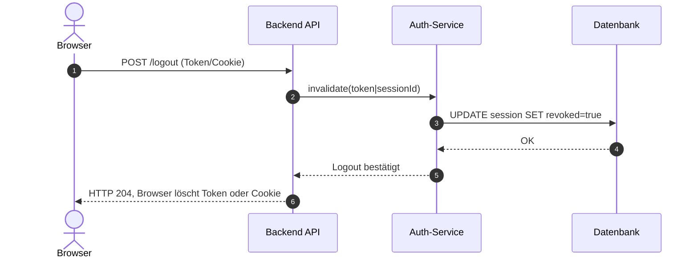
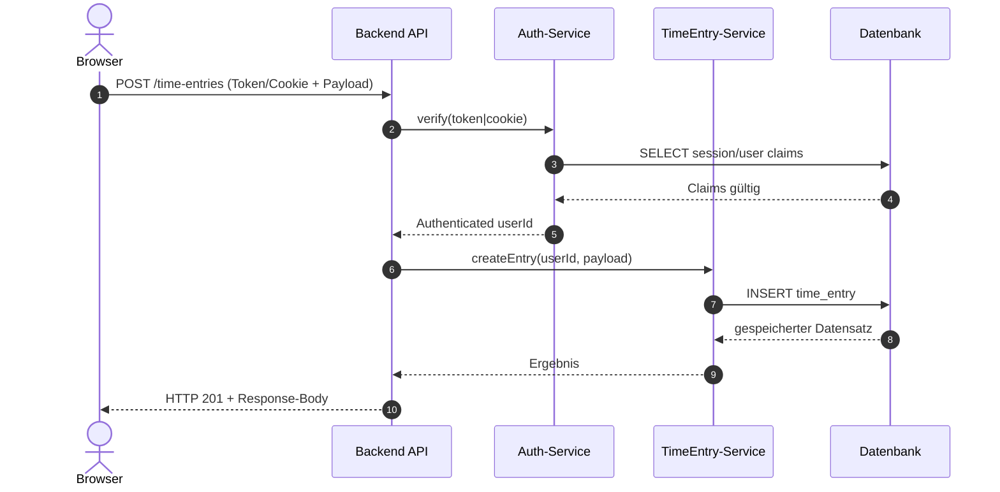

# UML

Eine kleine persönliche Medien Kollektion. Damit kann ich meine persönliche Medien Katalogisieren und bewerten. Es schafft mir auch einen Überblick mit allen nötigen Informationen. Ich könnte z.B nach dem Rating ordnen und so einen Überblick über meine beliebtesten Medien schaffen.

## Authentication und Authorization

Nachfolgend drei Sequenzdiagramme, welche den kompletten Fluss einer Anfrage von der Auslösung im Browser bis in die Datenbank und zurück zeigen. Die Varianten sind so aufgebaut, dass sowohl JWT (Token im `Authorization` Header) als auch klassische Session-Cookies unterstützt werden können – die Unterscheidung passiert im Auth-Service (z.B. durch Signaturprüfung bei JWT oder durch Lookup einer Session-Tabelle).

### Anmeldung (Login)

### Abmelden (Logout)

### Authentifizierung bei einer Datenabfrage (z.B. Zeiteintrag erfassen)

